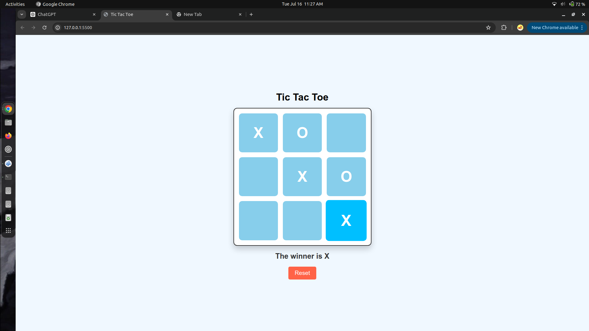

# Tic Tac Toe

A simple, interactive Tic Tac Toe game built with HTML, CSS, and JavaScript. This project demonstrates the basic implementation of the game logic, including win and draw detection, and offers a polished UI with responsive design.

## Features

- Two-player game (X and O)
- Detects win conditions
- Detects draw conditions
- Reset functionality to start a new game
- Responsive and visually appealing design

## Technologies Used

- HTML
- CSS
- JavaScript

## Getting Started

Follow these instructions to get a copy of the project up and running on your local machine.

### Prerequisites

You need a modern web browser to run this project.

### Installation

1. Clone the repository:
   ```sh
   git clone https://github.com/debrajroyofficial000/TicTacToe.git
   ```
2. Navigate to the project directory:

   ```sh
   cd TicTacToe
   ```

3. Open `index.html` in your web browser:
   ```sh
   open index.html
   ```

## Usage

- Click on any box to make a move.
- The game will automatically detect if there's a winner or if the game ends in a draw.
- Click the "Reset" button to start a new game.

## Project Structure

```
tic-tac-toe/
│
├── index.html    # The main HTML file
├── style.css     # The CSS file for styling
└── script.js     # The JavaScript file containing game logic
```

## Game Logic

- The game board is a 3x3 grid.
- Players take turns to place their mark (X or O) in an empty box.
- The game checks for winning conditions after each move.
- If all boxes are filled without a winner, the game declares a draw.

### Winning Conditions

The game checks the following combinations for a win:

- Rows: [0, 1, 2], [3, 4, 5], [6, 7, 8]
- Columns: [0, 3, 6], [1, 4, 7], [2, 5, 8]
- Diagonals: [0, 4, 8], [2, 4, 6]

## Screenshots




## Demo

[Demo](https://66960d0cb4404c374e8554ba--static-tic-tac-toe.netlify.app/)
